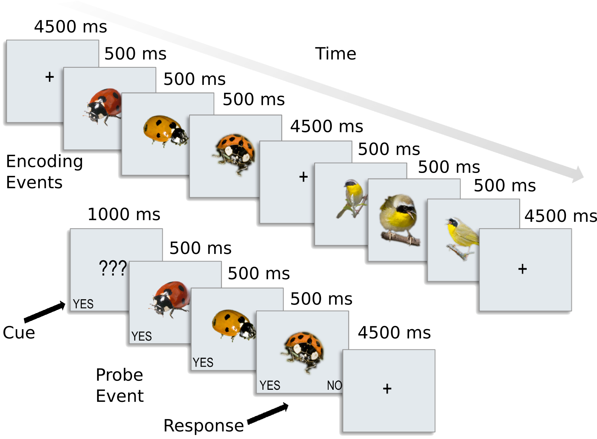
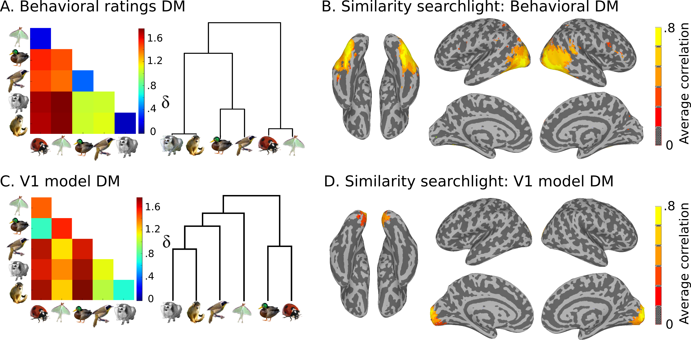

.. #   For CoSMoMVPA's license terms and conditions, see   #
   #   the COPYING file distributed with CoSMoMVPA         #

.. intro

Introduction
============

Goals of the workshop
+++++++++++++++++++++

    * Learn the basics of Multivariate Pattern Analysis
    * Get your hands dirty with data manipulation and algorithm implementation
    * Build a your own data analysis toolkit

**Why study brain imaging?**

Organization of Human Brain Mapping (OHBM) throws great parties.

.. figure:: _static/hbm.jpg

    OHBM 2013 in Seattle rented the Rock and Roll Museum for their "club night" party.

**What is MVPA?**

When applied to **fMRI** data it is multi-*voxel* pattern analysis.

But multi-*variate* analysis is general, and widely used set of techniques. Variables or *features* can be from all sorts of neuroscience data:

    * EEG
    * MEG
    * Multi-unit recording
    * Electrocorticography (ECoG)

... or almost anything else you can think of:

    * Geological data
    * *BIG* data culled from internet users
    * etc.

* What is a *pattern*?

  * **fMRI**: Pattern is a vector of voxels (time points, averages of conditions, :math:`\beta` stats, etc.)
  * In **general**: It is a vector of *features* or *variables*
  * In **practice**, i.e., in **MATLAB**: A pattern is a row vector.

A dataset is a set of patterns over the same features that are vertically
stacked on one another into a 2-D N x M matrix with N patterns and M features.
Patterns are sometimes called "observations" or "samples".  In this tutorial we
will call them samples.

In a simplistic and generic sense, MVPA includes any analysis where the outcome
is dependent on the variablility of measurements across a a samples by features
matrix.

**MATLAB** is an ideal environment for dealing with this sort of data with
hundreds of function for do MVPA analysis on rectangular matrices, some of which
you may be familiar with:

    * **corrcoef**: compute the pair-wise correlations for a set of column vectors
    * **cmdscale**: classic multidimensional scaling
    * **svmclassify / svmtrain**: support vector machine
    * **procrustes**: Procrustes transformation (used in `hyper-alignment <http://haxbylab.dartmouth.edu/ppl/swaroop.html>`_, )
    * and many many others ...

MVPA Dataset
++++++++++++

Given this general formulation, our workshop will aim to build a foundation and
a working MATLAB toolbox for MVP analysis around the **dataset** as a common
starting point. For this we have adopted the terminology and many of the
semantics of the `PyMVPA <http://www.pymvpa.org/>`_ Python library which you are
encouraged to learn more about especially if you interesting in learning to
program in `Python <http://www.python.org/>`_.

Other useful resources:

    * `NeuroDebian <http://neuro.debian.net>`_ : One stop shopping for all Neuroscience related computing needs
    * `Numpy for MATLAB users <http://mathesaurus.sourceforge.net/matlab-numpy.html>`_

Code for the workshop
+++++++++++++++++++++

`Get the code for the workshop here. <http://discovery.dartmouth.edu/~aconnoll/cosmo_mvpa/_static/cosmo_mvpa_scripts.zip>`_

Sample Dataset
++++++++++++++

We have preprocessed data for 8 subjects from :cite:`CGG+12`.
A slow event-related design with six different types of animals.

The six categories included 2 primates: monkeys and lemurs; 2 birds: mallard ducks and yellow-throated warblers; and 2 bugs: ladybugs and luna moths.

We also have model similarity structures, which you can see here:

Plan for the day
++++++++++++++++

#. Learn how to manipulate data as a "**cosmo_fmri_dataset**"
#. Do several exercises with pattern classification
    * Split-half correlations
    * Write your own Nearest-neighbor classifier
    * Write a wrapper for MATLAB's support vector machine functions to work with
      dataset
    * Implement a N-Fold data partitioner for cross-validation
    * Write an abstraction of cross-validation as a "dataset measure"
#. Representational Similarity Analysis
    * Viewing dissimilarity matrices
    * Comparign dissimilarity matrices
    * Write an abstraction "RSA dataset measure"
#. Searchlight analysis
    * Implement a function to calculate sphere offsets for searchlight
    * Implement searchlight with cross-validation
    * Implement RSA searchlight
    * View searchlight results

In the end we will keep the cosmo_mvpa toolbox in a public repository on
git-hub.  Here: https://github.com/andycon/cosmo_mvpa You (or any one else) may
"clone" the repository using `git <http://git-scm.com/>`_ and contribute your
own code to the project.
