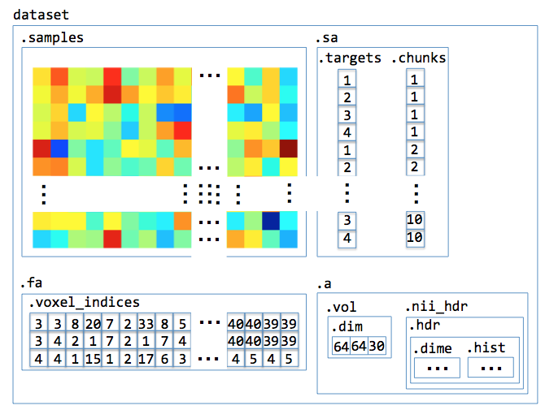
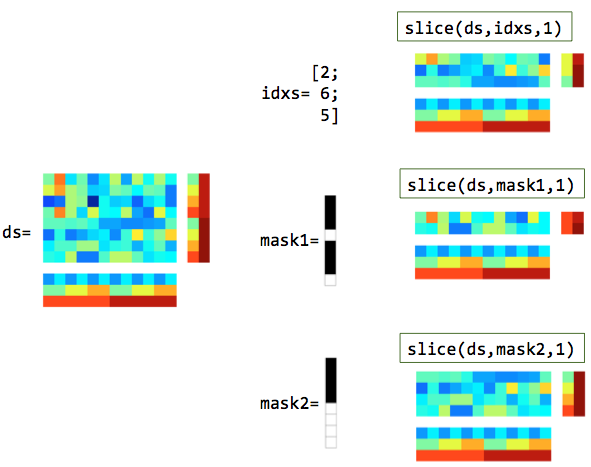
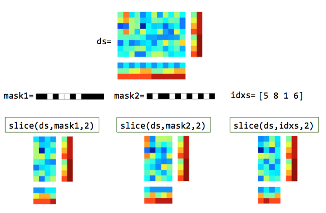
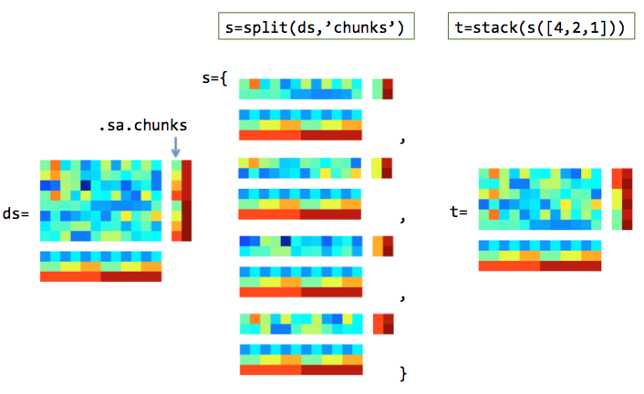

.. #   For CoSMoMVPA's license terms and conditions, see   #
   #   the COPYING file distributed with CoSMoMVPA         #

.. _`cosmomvpa_concepts`:

==================
CoSMoMVPA concepts
==================

.. contents::
    :depth: 2

.. _`cosmomvpa_dataset`:

Dataset
^^^^^^^
Given the general formulation of :ref:`patterns <mvpa_concepts>` as used in MVPA, this section will describe a framework that can be used to to MVPA in Matlab easily. Inspired by PyMVPA_, the matrix representation of patterns is expanded to form the concept of a *Dataset*, which contains:

    - a sample-by-feature data matrix.
    - sample attributes: attributes for each sample (row) in the data matrix.
    - feature attributes: attributes for each feature (column) in the data matrix.
    - dataset attributes: general attributes that are not linked specifically to samples or features.

In analogy with a table with data, the sample attributes can be seen as the row headers and the feature attributes as the column headers. However, each sample and feature (i.e. row and column) can have multiple attributes associated with them.

For example, an fMRI dataset in CoSMoMVPA can be visualized as follows:

A more detailed explanation is provided below.

Attributes
++++++++++
Just the data in the sample-by-feature data matrix not sufficient to be able to perform analyses; typically one needs additional descriptors (or attributes) indicating what a sample or feature represents. In the Dataset representation used in CoSMoMVPA, there are three types of attributes:

Sample attributes
-----------------
Sample attributes ontain information about each sample (and is the same across all features), and are stored in a field ``.sa``. Most MVPA requires at least the following two sample attributes:

    * ``.sa.targets``: represent the class of each sample. In the fMRI example above, these would be the category of the stimulus (monkeys, lemurs, ladybugs or lunamoths). In CoSMoMVPA, these are represented numerically; for example, 1=monkey, 2=lemur, 3=ladybug, 4=lunamoth).
    * ``.sa.chunks``: samples with the same chunks represent a group of samples that is acquired 'independently' from samples in other chunks. Independently is hard to define precisely, but in fMRI it usually refers to a single run of acquisition. In the fMRI example above, there are 10 chunks, each with 4 samples. In a take-one-out cross-validation analysis, for example, one tests a classifier on the samples in one chunk after it has been trained on the samples in the remaining chunks.

    Note that in the example here there is a third sample attribute, ``.sa.labels``, which is a cell containing human-readable descriptions of each sample.

Feature attributes
------------------
Feature attributes contain information about each feature (and is the same across all samples), and are stored in a field ``.fa``. These are optional in principal, but in most use cases these are used to specify information where the feature came from.

    * in fMRI: the voxel indices associated with each feature. With three spatial dimensions each feature is associated with three indices, ``.fa.i``, ``.fa.j``, and ``.fa.k``.
    * in MEEG: the indices of SQUID sensor, time-point, or frequency band. For example, data transformed to time-frequency space has three feature attributes: ``.fa.chan``, ``.fa.time``, and ``.fa.freq``.

Dataset attributes
------------------
Dataset attributes contain general information about the whole dataset.

    In fMRI these are typically:

    * A ``.a.vol`` field containing information about the voxel-to-world mapping. This is required to map the spatial location of each voxel from `voxel coordinates` (integer indices) to `world coordinates` (metric units, typically milimeters). Currently this is stored in a 4x4 ``.a.vol.mat``  affine transformation matrix that follows the ``LPI`` (left-to-right, posterior-to-anterior, inferior-to-superior) convention (non-affine transformations are currently not supported).
    * The range of indices used in ``.fa.i``, ``.fa.j`` and ``.fa.k``, stored in ``.a.fdim.values``.
    * The names of the spatial feature attributes, stored in ``.a.fdim.labels``.

    In MEEG these are, for a dataset with data in time-frequency space:

    * The names of the feature attribtues (``chan``, ``time``, and ``freq``), stored in ``.a.fdim.labels`` .
    * channel names are stored in the field ``.a.fdim.values{1}``, time-points in ``.a.fdim.values{2}``, and frequencies in ``.a.fdim.values{3}``. In such a dataset, the feature attribute ``.fa.chan``, ``.fa.time``, and ``.fa.freq``, contain integers that index the corresponding elements in ``.a.fdim.values``.

.. _`cosmomvpa_targets`:

Targets
+++++++
The example above showed the sample attribute ``targets``, and its use is not by accident. As for almost all MVPA applications one is interested in the (dis)similarity of patterns within and across *conditions of interest*, these should be stored in the dataset. Here, conditions of interest is typically defined by the experimental paradigm, for example:

    * category of visual stimulus: house, face, or human body.
    * effector involved in movement planning: left hand or right hand.
    * whether a peri-threshold auditory stimulus was perceived: yes or no.

In CoSMoMVPA_ these conditions are coded in a special *sample attribute* called *targets*, i.e. in a dataset ``ds`` they are in ``ds.sa.targets``. They should be coded as integer values in a ``Px1`` vector, where ``P`` is the number of samples.

.. _`cosmomvpa_chunks`:

Chunks
++++++
Another sample attribute illustrated above (that is also important for most MVPA applications) is the concept of *chunks*. Here, a *chunk* is meant to indicate a set of samples that can be considered **independent** from samples in other chunks, whereas samples within a chunk are not necessarily independent.

Independence is crucial here, because many core MVP analyses assess generalizability of pattern properties of a subset of chunks to another disjoint subset of chunks. For example:

    * in split-half correlation analysis, the data is split in two and each half assigned to a different chunk, yielding two chunks. A typical application is computing 'on-diagonal' vs 'off-diagonal' correlations, i.e. the difference of pattern correlations of the same target versus other targets.
    * in an ``n``-fold cross-validation scheme, the data is split in ``n`` chunks. A typical application is cross-validated classification, where a classifier is tested on one chunk after being trained on the remaining chunks.

Typical chunk assignments are:
    * in fMRI studies: each run (period of continuous recording) gives rise to a single chunk. Putting samples in a single run in different chunks may violate the independency assumption because of the slow-ness of the BOLD response, unless samples are seperated by a considerable time interval.
    * in MEEG studies: if trials can be assumed to be independent (which most people in MEEG studies seem to do), then chunks can be assigned randomly (or in a systematic order). This can be done pseudo-randomly using :ref:`cosmo_chunkize`. If the indendency assumption cannot be fullfilled then chunks should be assigned on a run-by-run basis.

As with *targets* above, *chunks* should be coded as integer values in a ``Px1`` vector, where ``P`` is the number of samples.

Samples + sample attributes + feature attributes + dataset attributes = dataset
+++++++++++++++++++++++++++++++++++++++++++++++++++++++++++++++++++++++++++++++
Taken the above together, a CoSMoMVPA dataset contains four ingredients: 'samples' (the sample x features data matrix), 'sample attributes', 'feature attributes', and 'dataset attributes'. These are implemented, in Matlab, using a ``struct``, with fields ``.samples``, ``.sa``, ``.fa``, and ``.a``. For example an fMRI dataset can be instantiated using :ref:`cosmo_fmri_dataset` and might contain:

``.samples``,

    .. code-block:: matlab

        [ 0.568       3.9      4.11  ...   0.732     0.473      2.37
           1.45      3.71      4.86  ...  -0.265     0.846     0.544
           2.23      1.31      2.76  ...   0.314     0.485    -0.335
            :         :         :            :        :          :
           2.06      1.46      3.52  ...  -0.162  -0.00311     0.488
          0.596      1.96      3.93  ...   0.147      1.16      3.14
          -1.35     0.511    -0.116  ...  -0.628     0.756     0.628 ]@40x298

``.sa``,

    .. code-block:: matlab

        .targets
          [ 1
            2
            3
            :
            2
            3
            4 ]@40x1
        .chunks
          [  1
             1
             1
             :
            10
            10
            10 ]@40x1

``.fa``,

    .. code-block:: matlab

        .i
          [ 44        42        43  ...  43        40        41 ]@1x298
        .j
          [ 15        15        15  ...  16        19        19 ]@1x298
        .k
          [ 3         4         4  ...  13        13        13 ]@1x298

and ``.a``:

    .. code-block:: matlab

        .fdim
          .labels
            { 'i'  'j'  'k' }
          .values
            { [ 1         2         3  ...  78        79        80 ]@1x80  [ 1         2         3  ...  78        79        80 ]@1x80  [ 1         2         3  ...  41        42        43 ]@1x43 }
        .vol
          .mat
            [ 3         0         0      -122
              0         3         0      -114
              0         0         3     -11.1
              0         0         0         1 ]
          .dim
            [ 80        80        43 ]

In this case there are M=40 samples and N=43822 features (voxels). Note that the sample attributes have M values in the first dimension, and feature attributes have N values in the second dimension. The information in the ``.fa`` and ``.a`` fields is used when the dataset is back to a volumetric dataset in :ref:`cosmo_map2fmri`.

.. _`cosmomvpa_dataset_operations`:

Dataset operations
^^^^^^^^^^^^^^^^^^

Slicing
+++++++
Slicing refers to selecting data in a dataset struct, either along the rows or columns. It is provided by the :ref:`cosmo_slice` function, which takes three arguments: the dataset ``ds``, indices or a mask indicating what ``to_select``, and a ``dim`` argument indicating whether to slice along rows or colums.

- Slicing samples (``dim=1``; this is the default value) means that the specified *rows* are selected, both in ``.samples`` and each field in ``.sa`` (such as ``.sa.targets`` and ``.sa.chunks``).

    Use cases include:

    * Select only samples for certain conditions (targets)
    * Select only samples in certain chunks; this is useful for:

        + cross-validation: data is tested using data in, say, one chunk after training on data in the remaining chunks (see :ref:`cosmo_nfold_partitioner` and :ref:`cosmo_nchoosek_partitioner`).
        + split-half correlations: when half of the data (in one (set of) chunks) is correlated with data in the other half (see :ref:`cosmo_oddeven_partitioner` and `cosmo_correlation_measure`).

    Illustration of slicing rows (samples). In the masks, white elements are selected and black elements are not selected.

- Slicing features (``dim=2``) means that the specified *columns* are selected, both in ``.samples`` and each field in ``.fa`` (such as ``.fa.i``, ``fa.j`` and ``fa.k`` in an fMRI-dataset, which indicate the voxel indices). Use cases include:

    * Select only certain voxels in a region of interest
    * Running a searchlight, which consists of doing the analyses many regions of interest.

    Illustration of slicing columns (features). In the masks, white elements are selected and black elements are not selected.

Slicing-related functions
+++++++++++++++++++++++++

Related functions are:
    - :ref:`cosmo_split` splits datasets along one or more attributes (such as ``.sa.chunks`` and ``.sa.targets``).
    - :ref:`cosmo_stack` stacks dataset along the first or second dimension. In a way it is the inverse of ;ref:`cosmo_split`, but it can also be used to stack other sets of datasets. A typical use case is:

        * Use ``cosmo_slice`` or ``cosmo_split`` to select subsets of the data, for example based on each unique combination of ``.sa.chunks`` and/or ``.sa.targets``.
        * Perform a certain operation on each subset ot the data, such as computing the mean (averaging) or subtracting the mean (normalization), and store the output for each subset
        * Join the output of each subset using ``cosmo_stack``.

        For example, this :ref:`code <run_demean>` uses ``cosmo_split`` and ``cosmo_stack`` to subtract the mean (across samples) for each unique chunk seperately.

    - :ref:`cosmo_fx` splits the dataset using :ref:`cosmo_split`, applies a function to each element, and stacks the results. It can be used to average data for each value of ``.sa.targets`` seperately, for each unique value of ``.sa.chunks``, or for each unique combination of ``.sa.targets`` and ``.sa.chunks``.

    Illustration of splitting and stacking rows (samples).

.. _`cosmomvpa_classifier`:

Classifier
^^^^^^^^^^
A classifier takes a *training* set of patterns, each with a target (class label) associated with them, and a *test* set of patterns, that have no targets associated with them. The patterns in the train and test set should be from disjoint sets of chunks, otherwise circular analysis will ensue (which is a Bad Thing).

In CoSMoMVPA, all classifiers use the same signature:

    .. code-block:: matlab

        function predicted = cosmo_classify_lda(samples_train, targets_train, samples_test, opt)

where the inputs are:

    - ``samples_train`` is a ``PxR`` matrix for ``P`` samples and ``R`` features (i.e. it contains ``P`` patterns).
    - ``targets_train`` a ``Px1`` class label vector for each pattern in ``samples_train``.
    - ``samples_test`` is a ``QxR`` matrix with ``Q`` patterns, with no class labels associated
    - ``opt`` is an optional struct may contain specific options to be used with a specific classifier.

The output ``predicted`` is a ``Qx1`` vector containing the predicted class labels for each sample in ``samples_test``. Classification accuracy can be computed by considering how many samples in the test set were predicted, and this can be compared to what may be expected by chance. In the simple case where each chunk contains the same number of *n* samples in each class, chance accuracy is *1/n*. For MEEG datasets typically the number of samples in each class is not equal; the function :ref:`cosmo_balance_partitions` can be used to accomplish this.

Examples of classifiers are :ref:`cosmo_classify_nn`, :ref:`cosmo_classify_svm`, :ref:`cosmo_classify_lda`, and :ref:`cosmo_classify_naive_bayes`.

A classifier is typically used to test how well data in a subset of the data generalizes to another, disjoint, subset of the data. Usually this is done by taking some chunks as a test set, and use the remaining classes as a training set; by repeating this process, each time taking different chunks to form the test set, one or more predictions can be made for each sample in a dataset. Dividing up a dataset in pairs of training and test sets is called *partitioning*, which is facilitated using :ref:`cosmo_nchoosek_partitioner` , and its special case, :ref:`cosmo_nfold_partitioner`. A classifier can be used for cross-validation using :ref:`cosmo_crossvalidate`, or (see below), using a more abstract measure :ref:`cosmo_crossvalidation_measure`.

Note that, unless a :ref:`measure <cosmomvpa_measure>`, classifier functions are rather bare-bone as data structure; they do not operate on a dataset ``struct`` directly.

.. _`cosmomvpa_measure`:

Measure
^^^^^^^

A dataset measure is a function with the following signature:

    .. code-block:: matlab

        output = dataset_measure(dataset, args)

where ``dataset`` is a dataset of interest, and ``args`` are options specific for that measure. A measure can then be applied to either a dataset directly, or in combination with  a 'searchlight' where the measure is applied to each searchlight seperately. The output should be a ``struct`` with fields ``.samples`` (in column vector format) and optionally a field ``.sa`` - but no fields ``.fa`` and usually no field ``.a`` (except for a possible ``.a.sdim`` field, if the measure returns data in a dimensional format) .

For example, the following code defines a 'measure' that returns classification accuracy based ona support vector machine classifier that uses n-fold cross-validation. The measure is then used in a searchlight with a radius of 3 voxels; the input is an fMRI dataset ``ds`` with chunks and targets set, the output an fMRI dataset with one sample containing classification accuracies.

    .. code-block:: matlab

        nbrhood = cosmo_spherical_neighborhood(ds,'radius',3);
        cv = @cosmo_cross_validation_accuracy_measure;
        cv_args = struct();
        cv_args.classifier = @cosmo_classify_svm;
        cv_args.partitions = cosmo_nfold_partitioner(ds);
        sl_dset = cosmo_searchlight(ds,nbrhood,cv,cv_args);

Using classifiers and measures in such an abstract way is a powerful approach to implement new analyses. Any function you write can be used as a dataset measure as long as it uses the dataset measure input scheme, and can directly be used with (for example) a searchlight. When running a searchlight (:ref:`cosmo_searchlight`) with a `cosmomvpa_neighborhood`_ (see above), data from ``.fa`` and ``.a`` from the neighborhood are combined with the ``.samples`` and ``.sa`` output from the measure to form a full dataset structure with fields ``.samples``, ``.sa``, ``.fa``, and ``.a``.

Examples of measures include:

    + :ref:`split-half correlation <cosmo_correlation_measure>`.
    + :ref:`classification with cross-validation <cosmo_crossvalidation_measure>`.
    + :ref:`representational similarity analysis <cosmo_dissimilarity_matrix_measure>`.

.. _`cosmomvpa_neighborhood`:

.. _`searchlight`:

Neighborhood
^^^^^^^^^^^^
The tradional (volume-based fMRI) searchlight was introduced :cite:`KGB06` as a method to measure information content *locally* in the whole brain. In this approach, a sphere-shaped mask (usually with a radius of a few voxels) 'travels' through the brain, and at each location :ref:`measures <cosmomvpa_measure>` information content (such as correlation differences or classification accuracies). This process is done for each brain location, and the result assigned to the center voxel of each sphere. The result is an *information* (rather than univariate *activation*) map.

CoSMoMVPA_ overloads the *searchlight* concept through a more versatile *neighborhood* concept. A neighborhood definition describes a mapping that associates with each feature in the *target* domain (for the output) a set of features in the *source* domain (from the input). Neighborhoods are used for searchlight analyses (:ref:`cosmo_searchlight`), where the concept of a traditional fMRI volumetric searchlight is generalized to other types of datasets as well. For example:

    - for a traditional volume-based fMRI searchlight, the features in the source and target domain are the same, and consist of the voxels.
    - for a surface-based fMRI searchlight, the features in the source domain are the voxels in the volume, whereas the features in the target domain are the nodes on the surface.
    - for an MEG-based searchlight with magnetometers in the time-locked domain, the source and target domain are the set of all combinations of magnetometers and time points.
    - for an MEG-based searchlight with planar gradiometers (``meg_planar``) but with output as combined (``meg_combined_from_planar``) sensors, sensors in the source domain are the planar gradiometers and sensors in the target domain are the combined sensors.

A neighborhood is a ``struct`` with fields:

    - ``.neighbors``: an ``Nx1`` cell for N neighborhoods, where ``.neighbors{k}`` is a vector with features indices in the *source* domain associated with the ``k``-th neighborhood.
    - (optional) ``.fa`` the feature attributes for the target domain. Each field element ``.fa.field`` should have ``N`` elements in the second (i.e. feature) dimension.
    - (optional) ``.a`` the dataset attributes for the target domain.
    - (optional) ``.origin``, with subfields ``.a`` and ``.fa``, with attributes in the source domain. If present, this information is used when a neighborhood is applied to a dataset: if they do not match the attributes, an error is thrown. This can help in accidentally using the wrong neighborhood for a particular dataset.

When running a searchlight (:ref:`cosmo_searchlight`) with a `cosmomvpa_measure`_ (see below), data from ``.fa`` and ``.a`` from the neighborhood are combined with the ``.samples`` and ``.sa`` output from the measure to form a full dataset structure with fields ``.samples``, ``.sa``, ``.fa``, and ``.a``.

Neighborhood-related functions include:

    - :ref:`cosmo_spherical_neighborhood`: for fMRI spherical volume-based searchlight (c.f. :cite:`KGB06`), and MEEG source-space searchlight.
    - :ref:`cosmo_surficial_neighborhood`: for fMRI surface-based searchlight (c.f. :cite:`OWD+11`).
    - :ref:`cosmo_interval_neighborhood`: for MEEG searchlight for time or frequency domain (c.f. :cite:`LTO+14`).
    - :ref:`cosmo_meeg_chan_neighborhood`: for MEEG searchlight over sensors.

The :ref:`cosmo_cross_neighborhood` can *cross* different neighborhoods, which provides functionality for:

    - fMRI time-space searchlight, if multiple time points are associated with each trial condition; achieved by crossing a spherical or surficial neighborhood with an interval neighborhood (for the time dimension).
    - MEEG time-space searchlight; achieved by crossing a an interval neighborhood (for the time dimension) with a channel or source MEEG neighorhood.
    - MEEG time-space-frequency searchlight: achieved by crossing two interval neighborhoods (for the time and frequency dimensions) with a third (channel or source MEEG) neighborhood (:cite:`LTO+14`).

.. include:: links.txt

