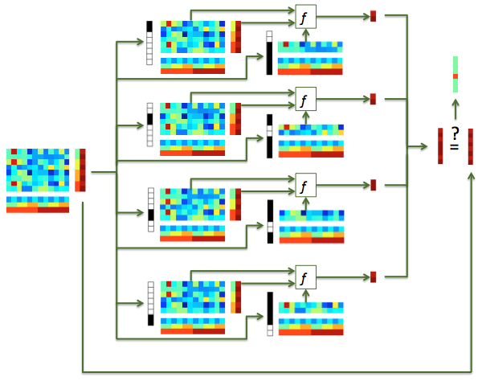

.. #   For CoSMoMVPA's license terms and conditions, see   #
   #   the COPYING file distributed with CoSMoMVPA         #

.. _`ex_nfold_crossvalidation`:

Classification analysis with cross-validation
=============================================

Background
++++++++++

In the :ref:`ex_classify_lda` exercise, data was split in even and odd runs, and a classifier trained and tested on these (respectively). In this exercise the use of cross-validation is shown using a dataset with ``N=10`` chunks.

    - data in a single chunk (here, the first run) is used as the test set
    - all other data is used for the train set.
    - the previous two steps are repeated for each of the ``N=10`` chunks:

        + for the ``i``-th repetition, the ``i``-th chunk is used for testing after training on all other chunks
        + this gives a prediction for each sample in the dataset
        + classification accuracy is, as before, computed by dividing the number of correct predictions by the total number of predictions

This procedure can be illustrated as follows:

    *Illustration of classification with cross-validation*. An input dataset (left), with 4 chunks and 2 targets in each chunk, is used for 4-fold cross-validation. In the ``i``-th fold (``i`` has values 1, 2, 3, 4), samples in the ``i``-th chunk is used for testing, and the remaining samples used for training. Predictions are computed for each sample in each test set, and the results combined, yielding a prediction for each sample in the input dataset.

Compared to odd-even classification demonstrated  :ref:`earlier <ex_classify_lda>`:

     + for every classification step there is a larger training set, which generally means better signal-to-noise, leading to better estimates of the training parameters, and thus better classification.
     + because a prediction is obtained for each sample in the dataset, more predictions are used to estimate classification accuracy, which leads to a better estimate of the true pattern discrimination.

Single subject, n-fold cross-validation classification
++++++++++++++++++++++++++++++++++++++++++++++++++++++

For this exercise, load a dataset using subject ``s01``'s T-statistics for every run
('glm_T_stats_perrun.nii') and the VT mask.

Part 1: implement n-fold crossvalidation
----------------------------------------
In this part you have to do cross-validation manually.

- Implement ``n-fold`` crossvalidation as described above, using the :ref:`LDA classifier <cosmo_classify_lda>`.
- Compute classification accuracy.
- Show a confusion matrix.

Part 2: use a partitioner
----------------------------------------

Because cross-validation is commonly used, CoSMoMVPA_ provides functions that define which samples are used for training and testing in each fold. Here, you can use :ref:`cosmo_nfold_partitioner` to obtain partitions for n-fold partitioning.

*Notes*:
    - Not used in this exercise, but also available, are:

        + :ref:`cosmo_oddeven_partitioner`, which gives two folds and thus yields faster classification, at the expense of smaller training sets
        + :ref:`cosmo_nchoosek_partitioner` provides advanced partitioning schemes for cross-modal and cross-participant classification.

    - :ref:`Another exercise <ex_measures_crossvalidation>` shows how a measure (:ref:`cosmo_crossvalidation_measure`) can be used for even easier cross-validation (using fewer lines of code).

Template: :ref:`run_nfold_crossvalidate_skl`

Check your answers here: :ref:`run_nfold_crossvalidate` / :pb:`nfold_crossvalidate`

.. include:: links.txt
