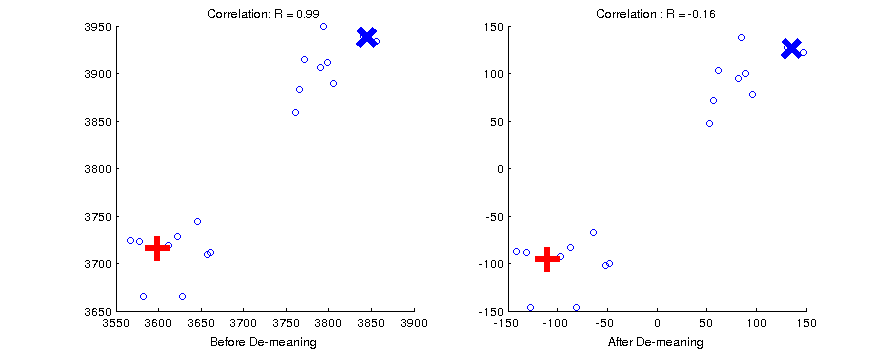

.. #   For CoSMoMVPA's license terms and conditions, see   #
   #   the COPYING file distributed with CoSMoMVPA         #

.. ex_rsa_visualization

Visualization of DSMs
=====================

Visualizing dissimilarity matrices
++++++++++++++++++++++++++++++++++

Load the saved variables in the files *v1_model.mat* and *behav_sim.mat*. These
should be in your data folder. These are dissimilarity matrices (DSMs) for
our six animals. The v1 model DSM was made by modeling each stimulus image
(jpeg) with a simple v1 cortical model, and then calculating the vector
distances between the stimuli using the features of the model.  The behavioral
DSM was made by having human subjects judge the similarity between every pair of
animals.

Note that these are ordinary DSMs that have zeros on the diagonal and are
symmetric about the diagonal. Use matlabs **imagesc** to view each DSM:

.. code-block:: matlab

    load v1_model;
    load behav_sim;
    subplot(1,2,1); imagesc(v1_model); title('V1 Model DSM');
    subplot(1,2,2); imagesc(behav); title('Behavioral DSM');

The categorical structure is obvious in the categorical dissimilarity, but not
in the v1 model DSM.

Now use matlab's **linkage** function to do hierarchical clustering on the DSMs.
**linkage** takes input in the form of the flattered upper triangle of the DSM
(as is output by **pdist**). So first flatten each DSM using **squareform**. In
order to view the dendrogram, we need to use matlab's **dendrogram** function.

Here is how to do this with the behavioral similarity:

.. code-block:: matlab

   hclus = linkage(squareform(behav));
   % We also want to have labels on our dendrogram
   labels = {'monkey','lemur','mallard','warbler','ladybug','lunamoth'};
   figure();
   dendrogram(hclus, 'labels',labels);
   title('Behavioral DSM - linkage');

Now let's use Matlab's classic multidimensional scaling (**cmdscale**) to look at
the DSMs in another way. **cmdscale** returns a set of factor scores for
dimension and stimulus. To view the first 2 dimensions we can use matlab's
**text** function:

.. code-block:: matlab

   F = cmdscale(behav);
   figure();
   text(F(:,1), F(:,2), labels);
   %
   % We will also need to set the axes so we can see all of the points
   % Let's use the maximum absolute magnitude
   mx = max(abs(F(:)));
   xlim([-mx mx]); ylim([-mx mx]);
   title('Behavioral DSM, cmdscale, dims 1 and 2');

Do this also for the V1 model DSM.

Now using the data from the "allruns" datasets, load one subject at a time,
compute the DSMs for VT and EV. Visualize them side-by-side using the three
methods above so that the output looks like the image below (subject 4).  You
will need to use matlab's subplot function for this.

.. image:: _static/visualize.png

Hint: :ref:`run_rsa_visualize_skl`.

Solution: :ref:`run_rsa_visualize` / :pb:`run_rsa_visualize`

Centering the data
++++++++++++++++++

A dataset can be thought of as a set of points in N-dimensional vector space.
This is easy to visualize with 2 or three dimensions (voxels), but it is
difficult to do with several hundred dimensions. Nevertheless, the math stays
the same whether you are dealing with 3 voxels or 3 hundred. Remember that our
fMRI data comes from a time-course analysis that included some estimation of the
*baseline* activity for each voxel. The statistics we have for our categories
are estimations of the differences from that baseline.  This means that the
origin of our vector space corresponds to that *arbitrary* baseline.

Because correlation distance is a measure of the angles between vectors, it is
sensitive to where the data cloud resides with respect to the origin. Ideally,
the origin of the vector space has a non-arbitray location so that it is
maximally informative about the relationships between our stimuli. We can
accomplish this by centering the data cloud on the origin of the space by
removing the mean value across conditions at each voxel.

See what happens to the correlation between two vectors marked with blue X and a
red cross in the figure below. On the left the data cloud has an arbitray
origin, and the vectors are almost perfectly correlated. After demeaning, they
are negatively correlated.

Thus before calculating a neural DSM, it is good to center the data first by
demeaning. Rerun your visualization script above by centering the data first.
How does this change the results?

Solution: :ref:`run_demean`

