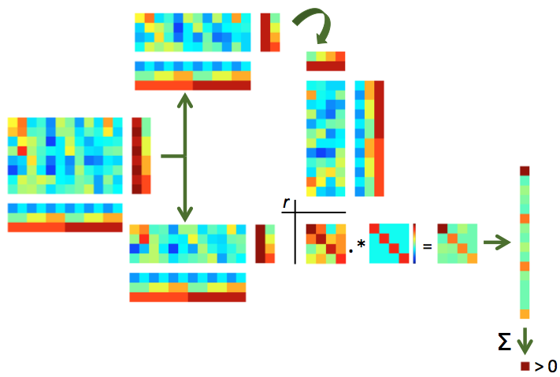

.. #   For CoSMoMVPA's license terms and conditions, see   #
   #   the COPYING file distributed with CoSMoMVPA         #

.. _`ex_splithalf_correlations`:

Split-half correlation-based MVPA with group analysis
=====================================================

Background
++++++++++
This exercise the most simple and most popular type of MVPA, that was first reported in :cite:`HGF+01`.
The intuition is to split the data in two halves (e.g. odd and even runs) and estimate the response for each category, voxel and half seperately. If an area represents categories in a distributed manner (over voxels), then correlations (over voxels) of matching categories may be higher than correlations of non-matching categories. If categories are not represented in such a way, one would expect no differences between correlations of matching and non-matching categories.

Briefly, the procedure can be visualized as follows:

    *Illustration of split-half correlations*. For split-half correlations, two chunks are required (e.g. odd and even runs) with matching targets. If not done yet, the data is split in two chunks (top and bottom). Each pattern in one half is correlated with each pattern in the other half, yeilding an ``NxN`` correlation matrix (with ``N`` the number of targets). Values in this correlation matrix are weighted positively if they are on the diagonal (matching target across the two halves) and negatively otherswise, in a way that all weights together add to zero, yielding a weighted correlation matrix (bottom right). If the sum of all elements in this matrix is positive, this indicates that the patterns contain target-specific information.

Exercise
++++++++
In this exercise data we use the handy functionality that :ref:`cosmo_fmri_dataset` provided us with to compute split-half correlations. Note that this exercise requires you to compute these correlations 'manually'; :ref:`another exercise <ex_measures>` shows how to use a CoSMoMVPA_ *measure* (:ref:`cosmo_correlation_measure`) that computes these values more conveniently.

.. _ex_single_subject_correlations:

Part 1 (single subject analysis)
--------------------------------
Using :ref:`cosmo_fmri_dataset`, load the t stats for 'odd' and 'even' runs for s01 (``glm_T_stats_odd.nii`` and ``glm_T_stats_even.nii``), while supplying the VT mask. As a reminder, the stimulus labels for each run of the fMRI study were monkey, lemur, mallard, warbler, ladybug, and lunamoth -- in that order. These two nifti files contain summary statistics (T statistics from the general linear model
analysis, GLM) for each stimulus for odd and even runs, respectively.

Apply the VT mask to each half, then compute all pairwise correlations between patterns in the first and the second half, resulting in a 6x6 matrix. After applying a Fisher transform, compute the mean difference between
values on the diagonal and those off the diagonal. If there is no category information one would expect a difference of zero.

Hint: :ref:`run_splithalf_correlations_single_sub_skl`

Solution: :ref:`run_splithalf_correlations_single_sub` / :pb:`splithalf_correlations_single_sub`

Part 2 (group study)
--------------------
As in the :ref:`previous exercise <ex_single_subject_correlations>`, compute the difference between the average on-diagonal versus on the odd-diagonal Fisher-transformed correlations. This time, do this for each subject and for the three ROIs (``ev``, ``vt``, ``brain``). For each ROI, gather the correlation difference for each subject and store these, then perform a one-sample t-test against zero to obtain a p-value against the null hypothesis of no correlation information in each region. Use a nested for loop (over ROIs in the outer loop, and subjects in the inner loop) when performing these computations.

Hint: :ref:`run_splithalf_correlations_skl`

Solution: :ref:`run_splithalf_correlations` / :pb:`splithalf_correlations`

Advanced exercise: plot an image of the 6x6 correlation matrix averaged over participants.

.. include:: links.txt

