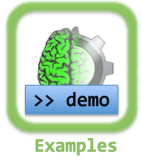

.. Cosmo documentation master file, created by
   sphinx-quickstart on Sun Aug 11 10:24:13 2013.
   You can adapt this file completely to your liking, but it should at least
   contain the root `toctree` directive.

.. figure:: _static/cosmomvpa_banner.png

A multi-modal, multi-variate pattern analysis (MVPA) toolbox in Matlab / GNU Octave for cognitive neuroscientists.

CoSMoMVPA
---------
- Provides simple, lightweight implementations of the most common types of MVPA of cognitive neuroscience data, such as classification with cross-validation, correlations, representational similarity analysis, and generalization over time.
- Supports most common fMRI (including NIFTI, ANALYZE, BrainVoyager, AFNI, GIFTI) and MEEG (FieldTrip, EEGLab)  data formats.
- Typical MVP analyses require a few lines of code.
- Handles fMRI volumetric, fMRI surface-based, and MEEG data through a uniform data structure.
- Supports searchlights in the volume, on the surface, over sensors, time bins, and frquency bands, and any combinations of these (e.g. sensor by time by frequency).
- Supports multiple-comparison correction using Threshold-Free Cluster Enhancement.
- Provides extensive documentation, including a variety of runnable scripts and implementation exercises (with solutions).
- Uses an automated test suite and continuous integration testing (through `Travis-ci`_).
- Runs on Matlab and GNU Octave.
- Is Free/Open Source Software (MIT License).

**Note: CoSMoMVPA is currently in a pre-first-release state. Features, code and documentation are relatively stable, but small changes may occur**

.. toctree::
   :hidden:

   philosophy
   news
   get_started
   download
   documentation
   cimec2014
   tips
   faq
   contact
   contribute
   thanks

.. image:: _static/icon_philosophy.png
   :target: philosophy.html
.. image:: _static/icon_get_started.png
   :target: get_started.html
.. image:: _static/icon_download.png
   :target: download.html
.. image:: _static/icon_modules.png
   :target: modindex.html
.. image:: _static/icon_documentation.png
   :target: documentation.html
.. image:: _static/icon_exercises.png
   :target: cimec2014.html
.. image:: _static/icon_tips.png
   :target: tips.html
.. image:: _static/icon_faq.png
   :target: faq.html
.. image:: _static/icon_contact.png
   :target: contact.html

.. image:: _static/icon_thanks.png
   :target: thanks.html

.. include:: news.rst
.. include:: _static/demo_gallery.txt
.. include:: _static/git_summary.txt

.. _matlab_pb_toc: _static/publish/index.html

Indices and tables
==================

* :ref:`genindex`
* :ref:`modindex`
* :ref:`search`

.. include:: links.txt

