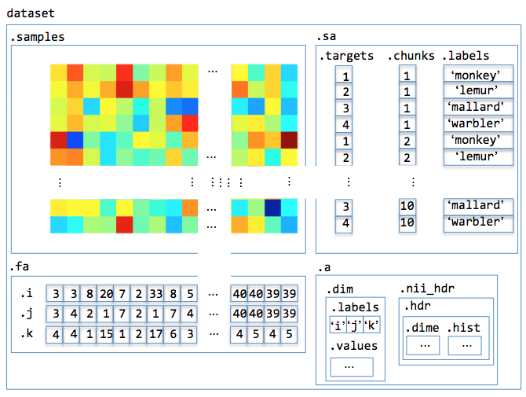
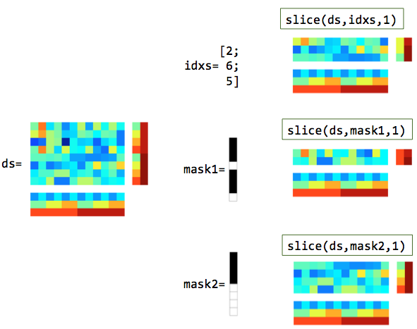
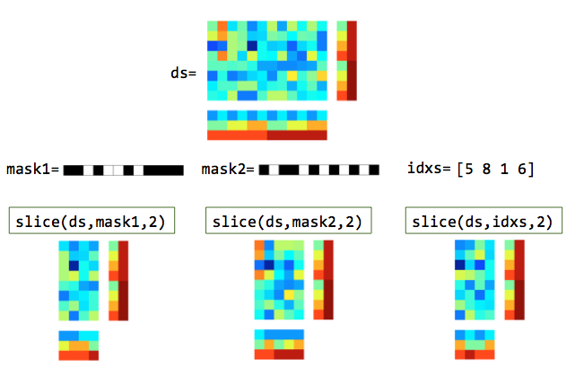

.. #   For CoSMoMVPA's license terms and conditions, see   #
   #   the COPYING file distributed with CoSMoMVPA         #

.. _philosophy:

====================
CoSMoMVPA philosophy
====================

.. contents::
    :depth: 2

^^^^^^^^^^^^^^^^^^^^^^^^^^^^^^
Uniform representation of data
^^^^^^^^^^^^^^^^^^^^^^^^^^^^^^

(This is inspired by PyMVPA_).

    + volumetic fMRI, surface-based fMRI, MEEG timelocked, and MEEG time-frequency data is represented using the same structure
    + through external toolboxes and CoSMoMVPA_ conversion code, data can be mapped to and from CoSMoMVPA dataset representations (using :ref:`cosmo_fmri_dataset`, :ref:`cosmo_surface_dataset`, :ref:`cosmo_meeg_dataset`, :ref:`cosmo_map2fmri`, :ref:`cosmo_map2surface`, :ref:`cosmo_map2meeg`)

.. figure:: _static/cosmo_dataset_io.png

    Illustration of dataset input/output.

^^^^^^^^^^^^^^^^^^^^^^^^^^^^^^^^^^^^^^^^^^^^^^^^^^^^^^^^^^^^^^^^^^^^^^
Store data in matrix form along with additional attributes of the data
^^^^^^^^^^^^^^^^^^^^^^^^^^^^^^^^^^^^^^^^^^^^^^^^^^^^^^^^^^^^^^^^^^^^^^

    + each row in the matrix is a sample, also referred to as pattern.
    + each column in the matrix has data for a single feature (e.g. voxel, surface node, timepoint for a channel).
    + each row and column can have additional attributes, called sample attributes (such as condition or acquisition run number) and feature attributes (such as voxel location)
    + subsets of rows and columns (and the corresponding attributes) can be :ref:`split <cosmo_split>` or :ref:`selected <cosmo_slice>` (optionally after :ref:`matching <cosmo_split>`), and :ref:`combined <cosmo_stack>`), which makes many operations simple:
        - :ref:`cross-validation <cosmo_crossvalidation_measure>` using various partition scheme (:ref:`odd-even <cosmo_oddeven_partitioner>`, :ref:`nfold <cosmo_nfold_partitioner>`, or :ref:`more complicated <cosmo_nchoosek_partitioner>`) requires selecting a set of rows for training and a disjoint subset for testing.
        - ROI selection requires :ref:`selecting <cosmo_slice>` a set of columns.
        - a :ref:`searchlight <cosmo_searchlight>` is repeated ROI selection, where the selection can be defined in a neighborhood (in a :ref:`sphere <cosmo_spherical_neighborhood>`, time or frequency :ref:`interval <cosmo_interval_neighborhood>`, set of :ref:`channels <cosmo_meeg_chan_neighborhood>`, on the cortical :ref:`surface <cosmo_surficial_neighborhood>`, or a :ref:`combination <cosmo_cross_neighborhood>` of these to form time-channel or time-channel-frequency searchlights).

    Illustration of dataset structure

    Illustration of slicing rows (samples). In the masks, white elements are selected and black elements are not selected.

    Illustration of slicing columns (features). In the masks, white elements are selected and black elements are not selected.

^^^^^^^^^^^^^^^^^^^^^^^^^^^^^^^^^^^^^^^^^^^^^^^^^^^^^^^^^^^^^^^^^^^^^^^^^^^^^^^
Provide a common interface for typical MVPA :ref:`measures <cosmomvpa_measure>`
^^^^^^^^^^^^^^^^^^^^^^^^^^^^^^^^^^^^^^^^^^^^^^^^^^^^^^^^^^^^^^^^^^^^^^^^^^^^^^^
The following types of analyses are treated uniformly:

    + :ref:`split-half correlation <cosmo_correlation_measure>`.
    + :ref:`classification with cross-validation <cosmo_crossvalidation_measure>`.
    + :ref:`representational similarity analysis <cosmo_dissimilarity_matrix_measure>`.

^^^^^^^^^^^^^^^^^^^^^^^^^^^^^^^^^^^^^^^^^^^^^^^^^^^^^^^^^^^^^^^^^^^^^^^^^^^^
A :ref:`searchlight <cosmo_searchlight>` analysis is as easy as ROI analysis
^^^^^^^^^^^^^^^^^^^^^^^^^^^^^^^^^^^^^^^^^^^^^^^^^^^^^^^^^^^^^^^^^^^^^^^^^^^^

    + a searchlight is like a repeated ROI analysis, where data in each searchlight can be described by a neighborhood of features around a center feature.
    + this approach can be applied equally to volume-based fMRI, surface-based fMRI, and MEEG data (assuming a neighborhood can be defined for each feature).
    + a searchlight map is created simply by applying an MVPA measure to data in each searchlight.

^^^^^^^^^^^^^^^^
More information
^^^^^^^^^^^^^^^^
More details are available about :ref:`CoSMoMVPA concepts <cosmomvpa_concepts>`:

    - :ref:`cosmomvpa_dataset`
    - :ref:`cosmomvpa_targets`
    - :ref:`cosmomvpa_chunks`
    - :ref:`cosmomvpa_dataset_operations`
    - :ref:`cosmomvpa_classifier`
    - :ref:`cosmomvpa_neighborhood`
    - :ref:`cosmomvpa_measure`

.. include:: links.txt
